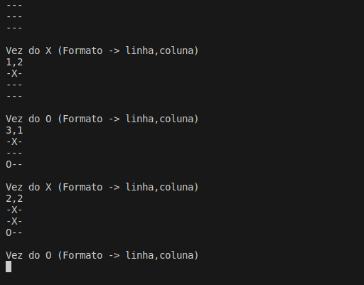

# Velha Master

**Descrição**

 Esse é um projeto de Jogo da Velha feito em C# com .NET. É possível fazer partidas normais entre pessoas, mas o foco é a interação com I.A's.
 
**Recursos**

* Partida normal entre dois humanos
* Desafio de jogar contra o Velha Master, tanto de X quanto de O. 
* Ver partida de Engine vs Engine.

**Objetivos**

O objetivo do projeto é utilizar diferentes algoritmos de I.A para aplicar nesse jogo simples de tabuleiro.

**Algoritmos**

Algoritmo Competitivo: Também conhecido como Minimax, funciona a base de força bruta, testando cada possibilidade até um estado terminal e retornando o melhor lance.

Algoritmo Capivara: Um jogador muito lerdo que joga lances imprecisos. Obs: Referência de Xadrez.

Algoritmo ANN: Uma Rede Neural Artificial que treinou com ajuda de mais de 500 mil dados, fornecido pelo Minimax. *Ainda em desenvolvimento*

**Instruções de instalação**

**Requisitos de sistema**

* .NET 8.0.0

**Instalação do aplicativo**

1. Entre na pasta do aplicativo
2. Execute o comando `dotnet run` para compilar e executar o projeto
3. Siga as instruções do terminal para começar

**Screenshots**

