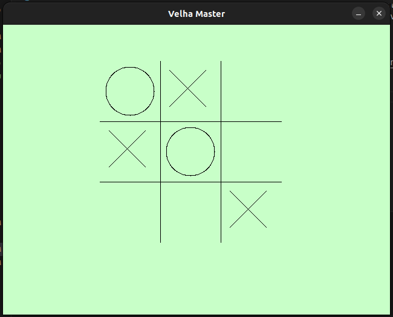

# Velha Master

Um projeto de Jogo da Velha.

* Você pode jogar Player vs Player, Player vs Maquina ou apenas ver uma partida entre os algoritmos.

* O modo normal é no terminal, mas também há uma interface gráfica simples. Você seleciona o modo de jogo por linha de execução do mesmo jeito, mas a partida ocorre na tela e os movimentos são feitos com o clique do mouse.

* A 'máquina' é um algoritmo que utiliza busca competitiva, o famoso minimax.

* Depois de 3 dias seguidos de pura depuração tentando ajustar a precisão do algoritmo, eu consegui. Finalmente o algoritmo Minimax alcançou uma precisão muito boa.

* Só não vou dizer que é uma precisão perfeita porque ele não difere posições minimamente melhores. Com 'posições melhores' quero dizer casos em que há mais chance do adversário errar. Se tiver como escolher entre duas posições empatadas, ele não vai se importar de saber que em uma o adversário tem mais opções de lances ruins e em outra só leva direto ao empate, ele escolhe qualquer uma delas.

* Instruções para a instalação:
    - Obviamente para um projeto em C++ precisará de um compilador de C++ instalado. O compilador utilizado no desenvolvimento foi o GNU 11.4.0, com o C++17.

    - Executar o Makefile já criado irá facilitar a compilação, e ainda há a possibilidade de editar ele.

    - A única biblioteca externa utilizada foi a de SDL2, para gerar a interface. Para utilizar o arquivo que inicia a interface, será necessário instalar ela. Caso não planeje baixar a biblioteca do SDL2, é possível apenas usar o aplicativo pelo terminal.

* Algumas screenshots:
    - Exemplo de partida Player vs Player no terminal.
    

    - Exemplo de partida Engine vs Engine com interface.
    

* Ideias a se considerar:
    - Criar uma rede neural que aprenda a jogar jogo da velha com apoio do Minimax.
    - Melhorar o código de interface, talvez com outra biblioteca.
    - Criar uma interface para o menu.